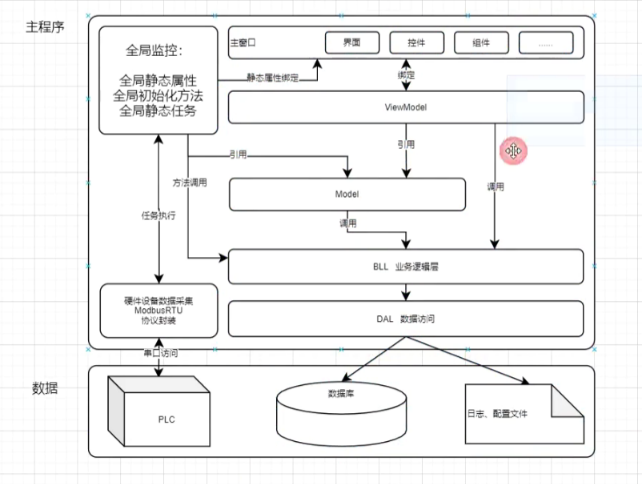
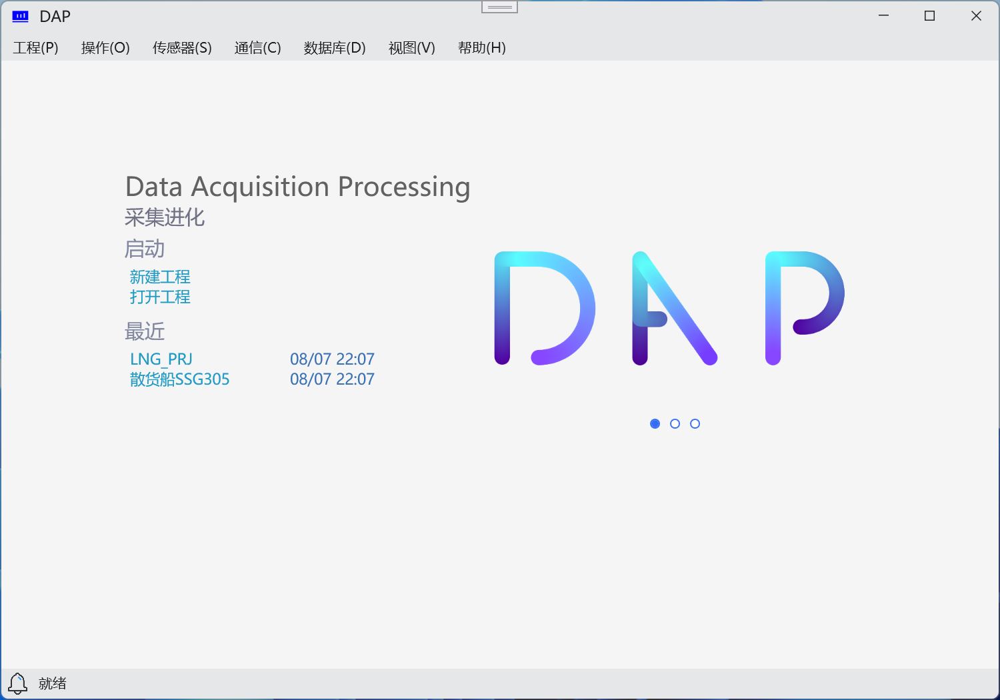
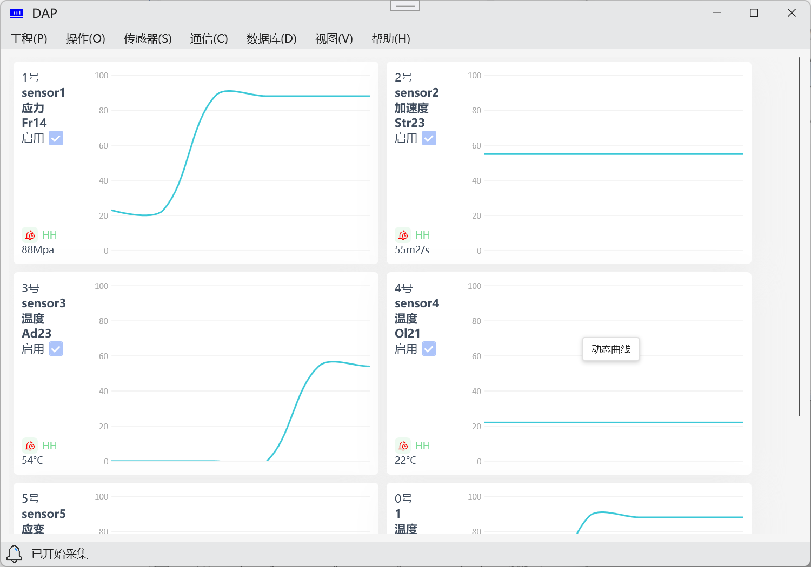
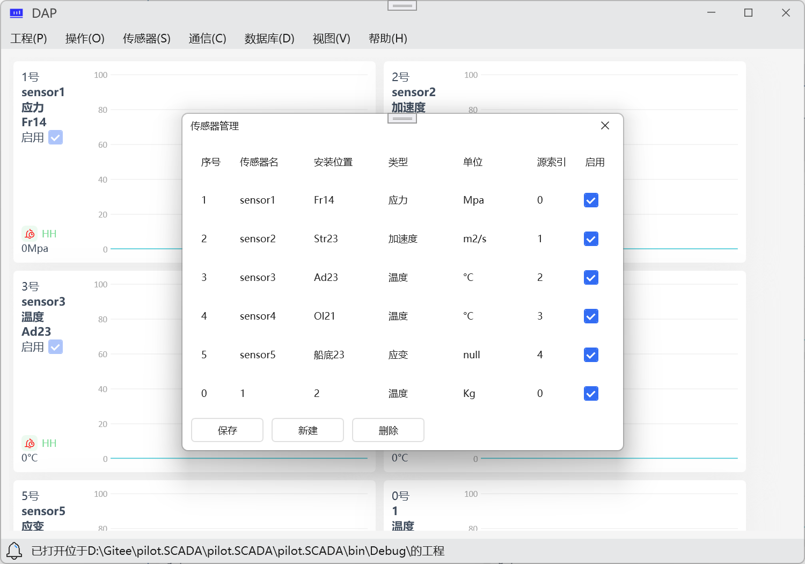
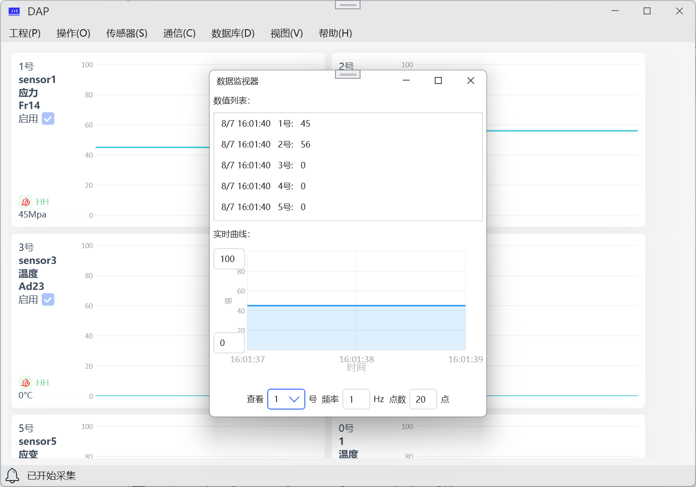

# pilot.SCADA

#### 介绍
这是一个通用数据采集处理软件。基于.Net Framwwork4.7.2 & WPF设计。软件有如下子系统

- 工程管理
- 通信管理
- 传感器管理
- 算法管理
- 数据库管理

#### 软件架构
MVVM

#### 安装教程

1.  下载Release版本
2.  解压下载文件
3.  双击文件夹内`pilot.SCADA.exe`运行

#### 使用说明

1.  新建或者打开工程
2.  通信对象创建
3.  传感器创建
4.  算法创建与绑定
5.  开始监测

#### 参与贡献

1.  Pilot.Phil

#### 软件截图

